# JOJOLands

| 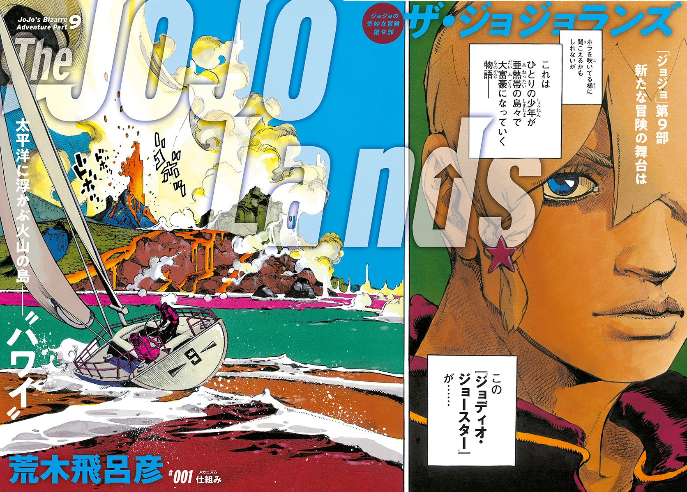 |
| :------------------------------: |
|     Figure 1. The JOJOLands      |

# Introduction

Welcome to JOJOLands, the ultimate destination for those seeking adventure, excitement, and a taste of the exotic. As you step onto this sub-tropical island, you’ll feel the warm sun on your skin and hear the lively chatter of the locals. But that’s not all – you’ve just been appointed as the mayor of JOJOLands, a coveted position granted to only the most daring and visionary individuals.

Beneath the surface of this paradise lies a world of mystery and intrigue. With every step you take, you’ll encounter Stand users, quirky restaurant owners, and a whole host of characters with unique stories and challenges to overcome. As mayor, it’s up to you to navigate this vibrant community and make decisions that will shape the future of JOJOLands.

Are you up for the challenge? Can you handle the responsibility of being the most powerful person on this island? If so, put on your adventurer’s hat and get ready to embark on a journey like no other. JOJOLands is waiting for you – are you ready to make your mark?

# Problem Statement

Hold up, pause for a moment. Can you believe that JOJOLands doesn’t actually exist in our reality? It’s a shame, really. But don’t let that discourage you – there’s still a way to experience the excitement and wonder of this fantastical island. You can create a virtual JOJOLands, a world that allows you to explore every nook and cranny of this incredible place and access all the missions that await you. With this virtual wonderland at your fingertips, you’ll be able to immerse yourself in the rich culture and thrilling adventures of JOJOLands like never before. Are you ready to bring this incredible world to life? It’s time to get creative and make your wildest dreams a reality!

# Basic Features

## 1. _Hermit Purple_ (1 mark)

|                         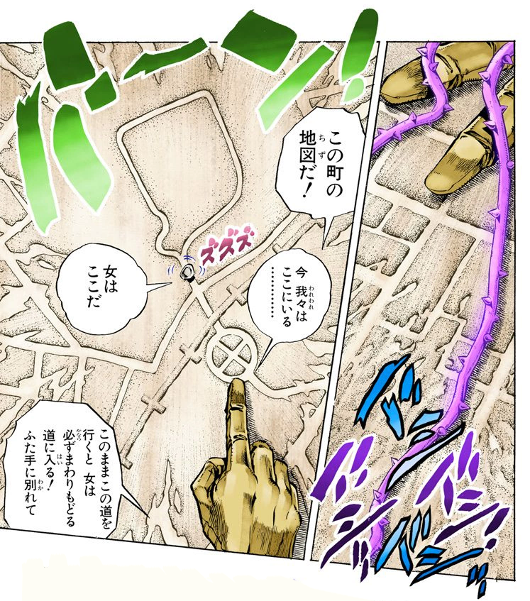                         |
| :------------------------------------------------------------------------------------: |
| Figure 2. Joseph conjures a map made entirely of dust using his Stand, _Hermit Purple_ |

### Description

Picture this: you’re standing at the heart of JOJOLands, the bustling _Town Hall_. From here, you have the power to explore every corner of this incredible island. The roads are your gateway to adventure, connecting each unique location on the map in a web of intrigue and excitement.

| 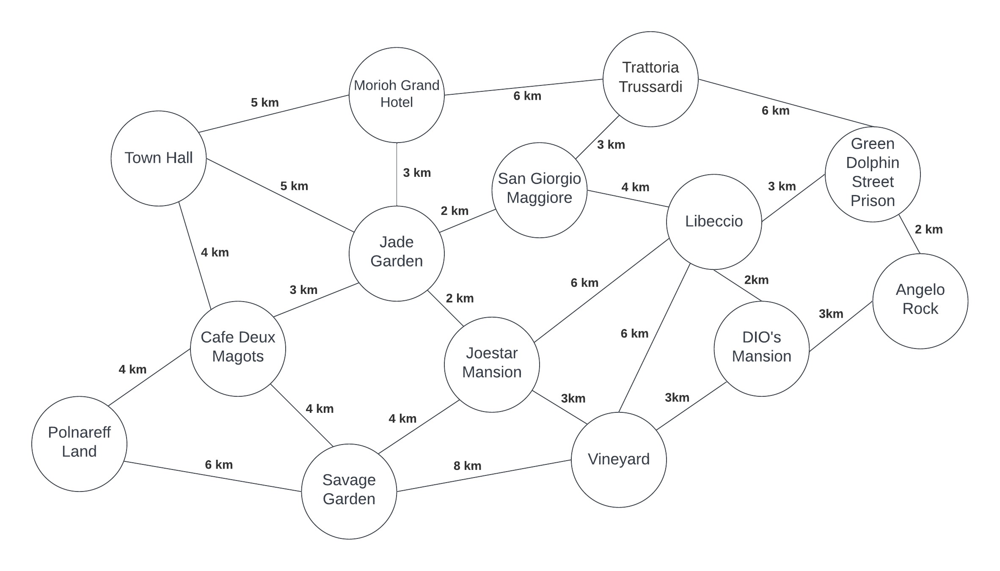  |
| :---------------------------------: |
| Figure 3. JOJOLands **Default Map** |

At the start of each day, you’ll find yourself back at the _Town Hall_, ready to embark on a brand new journey. The choice is yours – will you travel to the adjacent locations or revisit a place you’ve already been? With each decision, you have the power to shape your own destiny in JOJOLands.

But wait, there’s more – if you choose to backtrack, you’ll have the option to move forward in history and discover new paths to explore. And if you ever need a shortcut back to the _Town Hall_, there’s a secret route waiting for you to uncover.

In each location, you’ll be greeted with a plethora of missions, each one more exciting than the last. You’ll be able to access them all through a user-friendly interface, designed to help you navigate the challenges of JOJOLands with ease.

As you explore the vibrant world of JOJOLands, keep in mind that each day represents a new opportunity to make your mark. Starting from Day 1, which represents Sunday, you’ll need to select the corresponding option at the _Town Hall_ to advance to the next day. So what are you waiting for? Your destiny awaits – are you ready to seize it?

### Requirements

- Create a virtual game environment of JOJOLands based on the map given.
- A player can move to adjacent locations connected by roads from his current location.
- A player can travel back to the most recent location visited.
- A player can move forward in history if he chooses the back option.
- The system clears a player’s forward history when he decides to move to a new location.
- A player can choose to travel back to the _Town Hall_ directly.
- The system displays the available missions in each location.
- The system recognises the first day as Day 1, which represents Sunday.
- A player starts at the _Town Hall_ at the start of each day.
- A player can advance to the next day by selecting the corresponding option at the _Town Hall_.

### Sample Input/Output

```
It’s Day 1 (Sunday) of our journey in JOJOLands!
Current Location: Town Hall
[1] Move to:
    [A] Cafe Deux Magots    [B] Jade Garden    [C] Morioh Grand Hotel
[2] Advance to Next Day
[3] Save Game
[4] Exit

Select: 1C
======================================================================
Current Location: Morioh Grand Hotel
[1] Move to:
    [A] Jade Garden    [B] Town Hall    [C] Trattoria Trussardi
[2] View Resident Information
[3] The Hand
[4] Back (Town Hall)
[5] Back to Town Hall

Select: 1C
======================================================================
Current Location: Trattoria Trussardi
[1] Move to:
    [A] Green Dolphin Street Prison    [B] Morioh Grand Hotel
    [C] San Giorgio Maggiore
[2] View Waiting List and Order Processing List
[3] View Menu
[4] View Sales Information
[5] Milagro Man
[6] Back (Morioh Grand Hotel)
[7] Back to Town Hall

Select: 6
======================================================================
Current Location: Morioh Grand Hotel
[1] Move to:
    [A] Jade Garden    [B] Town Hall    [C] Trattoria Trussardi
[2] View Resident Information
[3] The Hand
[4] Back (Town Hall)
[5] Forward (Trattoria Trussardi)
[6] Back to Town Hall

Select: 1B
======================================================================
Current Location: Town Hall
[1] Move to:
    [A] Cafe Deux Magots    [B] Jade Garden    [C] Morioh Grand Hotel
[2] Advance to Next Day
[3] Save Game
[4] Back (Morioh Grand Hotel)
[5] Exit

Select: 2
======================================================================
It’s Day 2 (Monday) of our journey in JOJOLands!
Current Location: Town Hall
[1] Move to:
    [A] Cafe Deux Magots    [B] Jade Garden    [C] Morioh Grand Hotel
[2] Advance to Next Day
[3] Save Game
[4] Exit

Select: 4
======================================================================
```

Note that this here is just a sample input/output. So don’t feel like you’re bound to follow it down to the last letter! We give you complete freedom to unleash your creativity and come up with your own unique interface designs while still meeting all the requirements. For your information, we’ll be using the _Default Map_ for all our sample input/output unless specified otherwise.

## 2. _Heaven’s Door_ (1 mark)

|               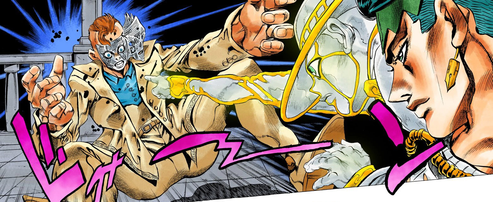               |
| :----------------------------------------------------------------: |
| Figure 4. Rohan reads a person’s life like an open book, literally |

### Description

Are you ready to explore JOJOLands and get to know its residents like never before? With the two files **residents.csv** and **stands.csv** (found in the **References** section), you can now develop a cutting-edge system that lets you access all the information on the residents in each residential area. And if a resident happens to be a Stand user, you’ll even get to view the details of their Stand - how cool is that?

But that’s not all. Your program will only accept inputs from both the specified files during runtime, without aggregating them beforehand. And to make it even more exciting, your system should allow you to sort the residents in any order you want. That’s right, you get to define the sorting order based on multiple fields. And forget about relying on Java’s _Arrays.sort_ method to sort the residents - you’ll need to develop your own efficient sorting algorithm!

So what are you waiting for? Get ready to dive into the world of JOJOLands and discover everything there is to know about its unique and diverse residents. The possibilities are endless, so start coding and see where it takes you!

### Requirements

- The system retrieves the information about the residents and Stands from the two provided files.
- A player can view all the information about the residents in each residential area.
- A player can view the information on a resident’s Stand if the resident is a Stand user.
- A player can sort the residents in a self-defined order by multiple fields, including each of their orders.
- Built-in sorting methods like _Arrays.sort_ are not allowed.
- The Stand parameters follow an ascending order of Infinity, A, B, C, D, E, ?, and Null.

### Sample Input/Output

```
Current Location: Polnareff Land
[1] Move to:
    [A] Cafe Deux Magots    [B] Savage Garden
[2] View Resident Information
[3] Back (Savage Garden)
[4] Back to Town Hall

Select: 2
======================================================================
Resident Information in Polnareff Land
+----+-----------------------+-----+--------+------------------+-
| No | Name                  | Age | Gender | Stand            |
+----+-----------------------+-----+--------+------------------+-
|  1 | Iggy                  | N/A | Male   | The Fool         |
|  2 | Jean Pierre Polnareff |  24 | Male   | Silver Chariot   |
|  3 | Muhammad Avdol        |  29 | Male   | Magician’s Red   |
|  4 | Noriaki Kakyoin       |  17 | Male   | Hierophant Green |
+----+-----------------------+-----+--------+------------------+-
-+-------------------+-------+-------+---------+-----------+-
 | Destructive Power | Speed | Range | Stamina | Precision |
-+-------------------+-------+-------+---------+-----------+-
 | B                 | C     | D     | C       | D         |
 | C                 | A     | C     | B       | B         |
 | B                 | B     | C     | B       | C         |
 | C                 | B     | A     | B       | C         |
-+-------------------+-------+-------+---------+-----------+-
-+-----------------------+
 | Development Potential |
-+-----------------------+
 | C                     |
 | C                     |
 | D                     |
 | D                     |
-+-----------------------+

[1] View Resident’s Profile
[2] Sort
[3] Exit

Select: 2
Enter the sorting order: Stamina (ASC); Precision (DESC); Stand (ASC);
======================================================================
Resident Information in Polnareff Land
+----+-----------------------+-----+--------+------------------+-
| No | Name                  | Age | Gender | Stand            |
+----+-----------------------+-----+--------+------------------+-
|  1 | Noriaki Kakyoin       |  17 | Male   | Hierophant Green |
|  2 | Muhammad Avdol        |  29 | Male   | Magician’s Red   |
|  3 | Jean Pierre Polnareff |  24 | Male   | Silver Chariot   |
|  4 | Iggy                  | N/A | Male   | The Fool         |
+----+-----------------------+-----+--------+------------------+-
-+-------------------+-------+-------+---------+-----------+-
 | Destructive Power | Speed | Range | Stamina | Precision |
-+-------------------+-------+-------+---------+-----------+-
 | C                 | B     | A     | B       | C         |
 | B                 | B     | C     | B       | C         |
 | C                 | A     | C     | B       | B         |
 | B                 | C     | D     | C       | D         |
-+-------------------+-------+-------+---------+-----------+-
-+-----------------------+
 | Development Potential |
-+-----------------------+
 | D                     |
 | D                     |
 | C                     |
 | C                     |
-+-----------------------+

[1] View Resident’s Profile
[2] Sort
[3] Exit

Select: 3
======================================================================
```

## 3. _Pearl Jam_ (1.5 marks)

|                    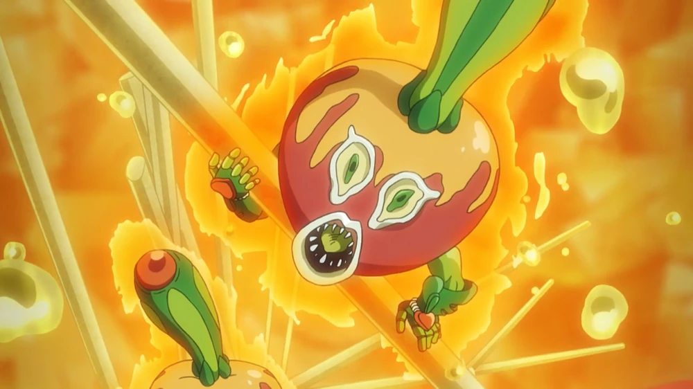                    |
| :-------------------------------------------------------------------: |
| Figure 5. _Pearl Jam_ reveals itself after Josuke fixes the spaghetti |

### Description

JOJOLands’ restaurants are not your typical eateries. They operate for only one hour, and customers are served in a special order. If you want to eat at your favourite spot, you have to arrive during that one hour. After the time is up, the restaurant starts processing orders in the order customers arrive. The waiting list is sorted by arrival time and includes every customer’s name, age, gender, and order. But here’s the kicker - the restaurant has a unique rule for processing orders that differs from place to place.

- For **_Jade Garden_**, the first and last customers to arrive are served first, followed by the second and second-last, and so on.
- **_Cafe Deux Magots_** has a more unusual system, where the oldest and youngest customers are selected from the queue in turns until everyone is served. If there are customers of the same age, it doesn’t matter which one is chosen. Those whose ages are not known will be the last to be served in any particular order.
- **_Trattoria Trussardi_** takes equality seriously and serves the youngest man first, followed by the oldest woman. In the next turn, it’s the oldest man and then the youngest woman. This process continues until everyone is served, but if there is only one gender left in the queue, only one person is chosen in the next turn. Similarly, customers of unspecified ages will be served last for each gender.
- Yet another restaurant has a rather peculiar method. **_Libeccio_** asks each person in the queue to say a number from 1, starting from the first person in the queue. If the number is a multiple of the current day number, the person is removed from the queue and served last. The next person removed is the one served last second, and so on. If we reach the end of the queue, we start over from the beginning.
- And lastly, **_Savage Garden_** has a rule similar to **_Libeccio_**. Each person in the queue is asked to say a number from 1, starting from the first person. If the number matches the day number, the person is served first. The next person starts over from 1, and if we reach the end of the queue, we start over from the last person and move in reverse order.

In case you were wondering, here are the default menus for the five restaurants:

- **_Jade Garden_**
  - Braised Chicken in Black Bean Sauce ($15.00)
  - Braised Goose Web with Vermicelli ($21.00)
  - Deep-fried Hiroshima Oysters ($17.00)
  - Poached Tofu with Dried Shrimps ($12.00)
  - Scrambled Egg White with Milk ($10.00)
- **_Cafe Deux Magots_**
  - Sampling Matured Cheese Platter ($23.00)
  - Spring Lobster Salad ($35.00)
  - Spring Organic Omelette ($23.00)
  - Truffle-flavoured Poultry Supreme ($34.00)
  - White Asparagus ($26.00)
- **_Trattoria Trussardi_**
  - Caprese Salad ($10.00)
  - Creme caramel ($6.50)
  - Lamb Chops with Apple Sauce ($25.00)
  - Spaghetti alla Puttanesca ($15.00)
- **_Liberrio_**
  - Formaggio ($12.50)
  - Ghiaccio ($1.01)
  - Melone ($5.20)
  - Prosciutto and Pesci ($20.23)
  - Risotto ($13.14)
  - Zucchero and Sale ($0.60)
- **_Savage Garden_**
  - Abbacchio’s Tea ($1.00)
  - DIO’s Bread ($36.14)
  - Giorno’s Donuts ($6.66)
  - Joseph’s Tequila ($35.00)
  - Kakyoin’s Cherry ($3.50)
  - Kakyoin’s Porridge ($4.44)

As mayor of JOJOLands, you have the authority to request the waiting list and order processing list of the current day when you visit a restaurant. Just remember, residents are only allowed to dine once per day!

### Requirements

- A player can view the waiting list and order processing list of a restaurant of the current day.
- A player can view the name, age, and gender of each customer and the food they ordered in the waiting list and order processing list.
- The system sorts the waiting list by the time the customers arrive in ascending order.
- The system generates the order processing list based on the rule specific to every restaurant, as stated above.
- No resident is allowed to dine more than once in one day.

### Sample Input/Output

```
Current Location: Jade Garden
[1] Move to:
    [A] Cafe Deux Magots      [B] Joestar Mansion
    [C] Morioh Grand Hotel    [D] San Giorgio Maggiore
    [E] Town Hall
[2] View Waiting List and Order Processing List
[3] View Menu
[4] View Sales Information
[5] Milagro Man
[6] Back (Town Hall)
[7] Back to Town Hall

Select: 2
======================================================================
Restaurant: Jade Garden

Waiting List
+----+--------------------+-----+--------+-
| No | Name               | Age | Gender |
+----+--------------------+-----+--------+-
|  1 | Jonathan Joestar   |  20 | Male   |
|  2 | Joseph Joestar     |  18 | Male   |
|  3 | Jotaro Kujo        |  17 | Male   |
|  4 | Josuke Higashikata |  16 | Male   |
|  5 | Giorno Giovanna    |  15 | Male   |
|  6 | Jolyne Cujoh       |  19 | Female |
+----+--------------------+-----+--------+-
-+-------------------------------------+
 | Order                               |
-+-------------------------------------+
 | Braised Chicken in Black Bean Sauce |
 | Scrambled Egg White with Milk       |
 | Braised Goose Web with Vermicelli   |
 | Poached Tofu with Dried Shrimps     |
 | Deep-fried Hiroshima Oysters        |
 | Braised Goose Web with Vermicelli   |
-+-------------------------------------+

Order Processing List
+----+--------------------+-----+--------+-
| No | Name               | Age | Gender |
+----+--------------------+-----+--------+-
|  1 | Jonathan Joestar   |  20 | Male   |
|  2 | Jolyne Cujoh       |  19 | Female |
|  3 | Joseph Joestar     |  18 | Male   |
|  4 | Giorno Giovanna    |  15 | Male   |
|  5 | Jotaro Kujo        |  17 | Male   |
|  6 | Josuke Higashikata |  16 | Male   |
+----+--------------------+-----+--------+-
-+-------------------------------------+
 | Order                               |
-+-------------------------------------+
 | Braised Chicken in Black Bean Sauce |
 | Braised Goose Web with Vermicelli   |
 | Scrambled Egg White with Milk       |
 | Deep-fried Hiroshima Oysters        |
 | Braised Goose Web with Vermicelli   |
 | Poached Tofu with Dried Shrimps     |
-+-------------------------------------+
======================================================================
```

## 4. The Joestars (1.5 marks)

|                                                             |
| :---------------------------------------------------------------------------------------: |
| Figure 6. The Joestars: Protagonists from the first six parts of JoJo’s Bizarre Adventure |

### Description

Are you curious about the eating habits of the residents in JOJOLands? Well, you’re in luck! When you visit a residential area, you can uncover the juicy details of any resident’s recent food and restaurant choices. And the best part? It all matches up perfectly with the daily sales records of the restaurants. You’ll be amazed to see how the Joestars’ unique food preferences influence their dining decisions:

- **Jonathan Joestar** values fairness above all else, ensuring that he doesn’t eat any food too frequently or infrequently. Specifically, the difference in frequency between the foods he eats most and least should not exceed 1.
- Meanwhile, **Joseph Joestar** is a culinary adventurer who won’t eat the same food twice until he’s tried everything currently available in JOJOLand’s.
- **Jotaro Kujo**, on the other hand, takes a methodical approach, as he will try every dish at one restaurant before moving on to the next.
- **Josuke Higashikata** is on a tight weekly budget of $100, so he must be careful not to overspend when dining out. If he must go over budget, he’ll borrow the least amount possible from others.
- **Giorno Giovanna** has a particular affinity for the Italian restaurant _Trattoria Trussardi_, and visits it twice a week. He always orders a different dish than his last visit, except when there’s only one option available.
- Finally, **Jolyne Cujoh** likes to switch things up and avoid dining at the same restaurant twice in a row. She and her father, Jotaro Kujo, always dine together at the same restaurant every Saturday.

With these unique preferences, it’s important to ensure that your random food selection algorithm matches the Joestars’ tastes and preferences and that the restaurant sales records and the Joestars’ food history align with these descriptions.

### Requirements

- A player can select a resident in a given residential area to view his detailed information.
- A player can view a resident’s recent food and restaurant history, which should match the restaurant’s daily sales records.
- The system randomly selects a food and restaurant for each resident.
- The random food selection algorithm should satisfy the Joestars’ food preferences.

### Sample Input/Output

```
Current Location: Joestar Mansion
[1] Move to:
    [A] Jade Garden    [B] Libeccio    [C] Savage Garden
    [D] Vineyard
[2] View Resident Information
[3] Back (Savage Garden)
[4] Back to Town Hall

Select: 2
======================================================================
Resident Information in Joestar Mansion
+----+----------------+-----+--------+------------------------------+-
| No | Name           | Age | Gender | Parents                      |
+----+----------------+-----+--------+------------------------------+-
|  7 | Joseph Joestar |  18 | Male   | George Joestar II, Lisa Lisa |
+----+----------------+-----+--------+------------------------------+-
-+---------------+ ...
 | Stand         | ...
-+---------------+ ...
 | Hermit Purple | ...
-+---------------+ ...

[1] View Resident’s Profile
[2] Sort
[3] Exit

Select: 1
Enter the resident’s name: Joseph Joestar
======================================================================
Joseph Joestar’s Profile
Name    : Joseph Joestar
Age     : 18
Gender  : Male
Parents : George Joestar II, Lisa Lisa

Stand                 : Hermit Purple
Destructive Power     : D
Speed                 : C
Range                 : D
Stamina               : A
Precision             : D
Development Potential : E

Order History
+-----+---------------------------------+---------------------+
| Day | Food                            | Restaurant          |
+-----+---------------------------------+---------------------+
|   1 | Caprese Salad                   | Trattoria Trussardi |
|   2 | Scrambled Egg White with Milk   | Jade Garden         |
|   3 | Poached Tofu with Dried Shrimps | Jade Garden         |
|   4 | Joseph’s Tequila                | Savage Garden       |
+-----+---------------------------------+---------------------+
======================================================================
```

The resident information in this sample has been abbreviated to keep this assignment at a _reasonable_ length.

## 5. _Moody Blues_ (1.5 mark)

|                           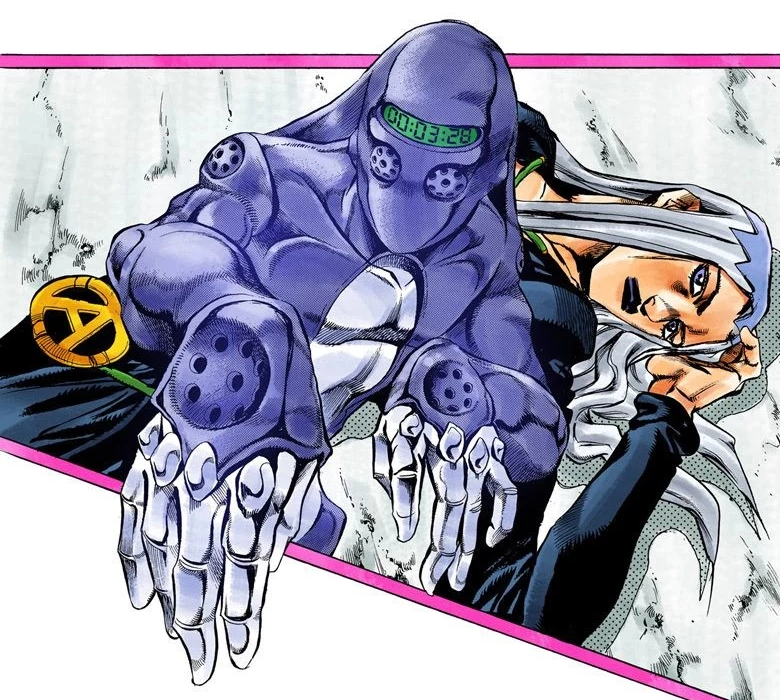                            |
| :-------------------------------------------------------------------------------------: |
| Figure 7. Abbacchio’s Stand, _Moody Blues_, with the ability to rebroadcast past events |

### Description

Imagine being able to keep track of every dish you sold in your restaurant, not just for a single day, but for a range of days! With the power of modern technology, restaurant owners can now access aggregated information of their sales over a specific range of days, and view everything from minimum and maximum sales to the top $k$ highest selling dishes.

The information is presented in a sleek and easy-to-read table format, allowing restaurant owners to quickly and easily analyse their sales data. They can even view the total and average sales for their restaurant over the selected time period. With this valuable data, restaurant owners can make informed decisions about their menu offerings and pricing strategies, helping them to run a successful business. So why leave your restaurant’s success to chance? Trust the data and take control of your sales today!

### Requirements

- A player can view the number of each food sold with its total price on a specific day.
- A player can specify a range of days to view the aggregated information on the sales.
- The aggregated information comprises the minimum, maximum, and top $k$ highest sales, as well as the total and average sales.
- The system should display the information in a table format.

### Sample Input/Output

```
Current Location: Jade Garden
[1] Move to:
    [A] Cafe Deux Magots      [B] Joestar Mansion
    [C] Morioh Grand Hotel    [D] San Giorgio Maggiore
    [E] Town Hall
[2] View Waiting List and Order Processing List
[3] View Menu
[4] View Sales Information
[5] Milagro Man
[6] Back (Town Hall)
[7] Back to Town Hall

Select: 4
======================================================================
Restaurant: Jade Garden
Sales Information
[1] View Sales
[2] View Aggregated Information
    [A] Minimum Sales
    [B] Maximum Sales
    [C] Top k Highest Sales
    [D] Total and Average Sales
[3] Exit

Select: 1
Enter Day: 1
======================================================================
Restaurant: Jade Garden
Day 1 Sales
+-------------------------------------+----------+-------------+
| Food                                | Quantity | Total Price |
+-------------------------------------+----------+-------------+
| Braised Chicken in Black Bean Sauce |        6 |      $90.00 |
| Braised Goose Web with Vermicelli   |        3 |      $63.00 |
+-------------------------------------+----------+-------------+
|                                    Total Sales |     $153.00 |
+-------------------------------------+----------+-------------+
======================================================================
Restaurant: Jade Garden
Sales Information
[1] View Sales
[2] View Aggregated Information
    [A] Minimum Sales
    [B] Maximum Sales
    [C] Top k Highest Sales
    [D] Total and Average Sales
[3] Exit

Select: 1
Enter Day: 2
======================================================================
Restaurant: Jade Garden
Day 2 Sales
+-------------------------------------+----------+-------------+
| Food                                | Quantity | Total Price |
+-------------------------------------+----------+-------------+
| Braised Chicken in Black Bean Sauce |        3 |      $45.00 |
| Scrambled Egg White with Milk       |       12 |     $120.00 |
+-------------------------------------+----------+-------------+
|                                    Total Sales |     $165.00 |
+-------------------------------------+----------+-------------+
======================================================================
Restaurant: Jade Garden
Sales Information
[1] View Sales
[2] View Aggregated Information
    [A] Minimum Sales
    [B] Maximum Sales
    [C] Top k Highest Sales
    [D] Total and Average Sales
[3] Exit

Select: 1
Enter Day: 3
======================================================================
Restaurant: Jade Garden
Day 3 Sales
+-------------------------------------+----------+-------------+
| Food                                | Quantity | Total Price |
+-------------------------------------+----------+-------------+
| Braised Chicken in Black Bean Sauce |       20 |     $300.00 |
| Poached Tofu with Dried Shrimps     |        2 |      $24.00 |
+-------------------------------------+----------+-------------+
|                                    Total Sales |     $324.00 |
+-------------------------------------+----------+-------------+
======================================================================
Restaurant: Jade Garden
Sales Information
[1] View Sales
[2] View Aggregated Information
    [A] Minimum Sales
    [B] Maximum Sales
    [C] Top k Highest Sales
    [D] Total and Average Sales
[3] Exit

Select: 2D
Enter Start Day: 1
Enter End Day: 3
======================================================================
Restaurant: Jade Garden
Total and Average Sales (Day 1 - 3)
+-------------------------------------+----------+-------------+
| Food                                | Quantity | Total Price |
+-------------------------------------+----------+-------------+
| Braised Chicken in Black Bean Sauce |       29 |     $435.00 |
| Braised Goose Web with Vermicelli   |        3 |      $63.00 |
| Poached Tofu with Dried Shrimps     |        2 |      $24.00 |
| Scrambled Egg White with Milk       |       12 |     $120.00 |
+-------------------------------------+----------+-------------+
|                                    Total Sales |     $642.00 |
|                                  Average Sales |     $214.00 |
+-------------------------------------+----------+-------------+
======================================================================
```

## 6. _Milagro Man_ (2 marks)

|                              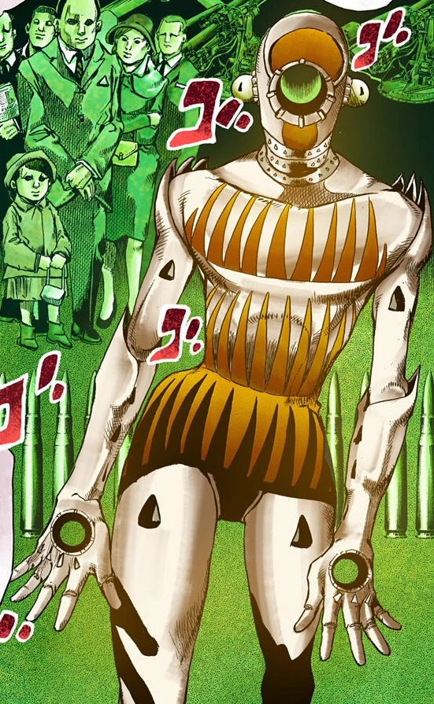                              |
| :-------------------------------------------------------------------------------------------: |
| Figure 8. _Milagro Man_ can keep generating money until his victim is buried to death in cash |

### Description

Let’s spice things up in JOJOLands game design! As it stands, there’s a limited selection of food choices available. But what if restaurant owners could add, modify, or remove dishes at their leisure? Sounds like a recipe for success, right? Don’t worry, any changes made won’t affect previous sales records - only food information from the following day onward will be updated.

Just keep in mind that tinkering with food prices could have a significant impact! To help restaurant owners experiment with different pricing strategies, we should add a new feature that allows them to modify food prices within a designated time range in the past. This experimental mode still lets owners query sales data to assess the impact of their pricing adjustments. And the best part? It’s all purely experimental, so there’s no need to worry about changing actual sales records!

### Requirements

- A player can create new food in a restaurant.
- A player can modify existing food information in a restaurant.
- A player can remove existing food in a restaurant.
- Modification of food information should only affect the sales records starting from the next day without affecting the previous sales records.
- Create a new option **_Milagro Man_** in each restaurant that allows a player to enter the experimental mode.
- In _Milagro Man_:
  - A player can modify any food price within a given range of days.
  - A player can perform the queries as in **5. _Moody Blues_** with the updated prices.
- The system restores sales records to their original state once a player exits the _Milagro Man_.

### Sample Input/Output

```
Current Location: Jade Garden
[1] Move to:
    [A] Cafe Deux Magots      [B] Joestar Mansion
    [C] Morioh Grand Hotel    [D] San Giorgio Maggiore
    [E] Town Hall
[2] View Waiting List and Order Processing List
[3] View Menu
[4] View Sales Information
[5] Milagro Man
[6] Back (Town Hall)
[7] Back to Town Hall

Select: 5
======================================================================
Restaurant: Jade Garden (Milagro Man Mode)
[1] Modify Food Prices
[2] View Sales Information
[3] Exit Milagro Man

Select: 1
Enter food name: Braised Chicken in Black Bean Sauce
Enter new price: $13
Enter Start Day: 1
Enter End Day: 2
======================================================================
Restaurant: Jade Garden (Milagro Man Mode)
[1] Modify Food Prices
[2] View Sales Information
[3] Exit Milagro Man

Select: 2
======================================================================
Restaurant: Jade Garden (Milagro Man Mode)
Sales Information
[1] View Sales
[2] View Aggregated Information
    [A] Minimum Sales
    [B] Maximum Sales
    [C] Top k Highest Sales
    [D] Total and Average Sales
[3] Exit

Select: 2D
Enter Start Day: 1
Enter End Day: 3
======================================================================
Restaurant: Jade Garden (Milagro Man Mode)
Total and Average Sales (Day 1 - 3)
+-------------------------------------+----------+-------------+
| Food                                | Quantity | Total Price |
+-------------------------------------+----------+-------------+
| Braised Chicken in Black Bean Sauce |       29 |     $417.00 |
| Braised Goose Web with Vermicelli   |        3 |      $63.00 |
| Poached Tofu with Dried Shrimps     |        2 |      $24.00 |
| Scrambled Egg White with Milk       |       12 |     $120.00 |
+-------------------------------------+----------+-------------+
|                                    Total Sales |     $624.00 |
|                                  Average Sales |     $208.00 |
+-------------------------------------+----------+-------------+
======================================================================
Restaurant: Jade Garden (Milagro Man Mode)
[1] Modify Food Prices
[2] View Sales Information
[3] Exit Milagro Man

Select: 3
======================================================================
```

Note that the total sales price of Braised Chicken in Black Bean Sauce comprises nine units priced at $13.00 and twenty units priced at $15.00.

## 7. _Super Fly_ (1.5 marks)

|                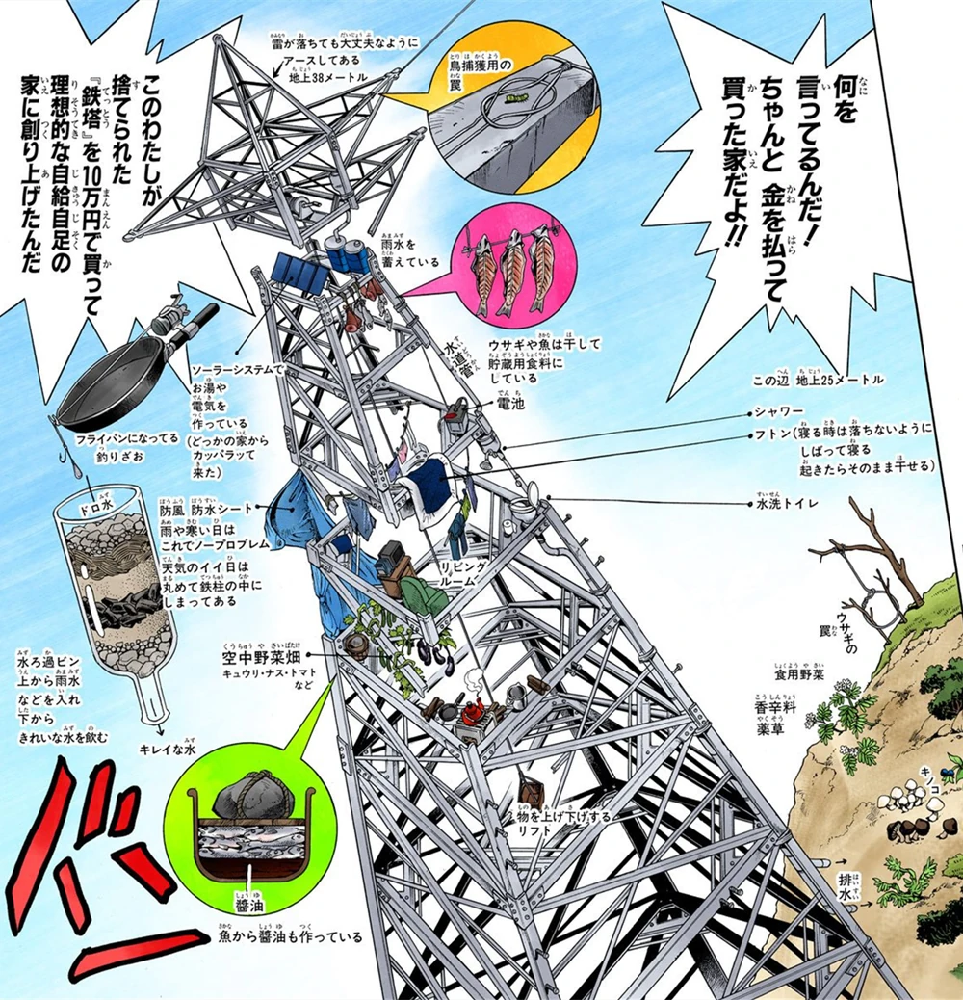                 |
| :------------------------------------------------------------: |
| Figure 9. The layout of Toyohiro’s Stand and home: _Super Fly_ |

### Description

When it comes to powering up their Stands and traversing the winding roads of JOJOLands, Akira Otoishi turns to his trusty _Red Hot Chili Pepper_. With its unique ability to pass through electricity flows along power cables, it’s the perfect way to visit other locations with ease. However, the seasoned Stand user can’t help but notice that the power cables in JOJOLands are showing their age, causing him to face difficulties from time to time. Ever the proactive problem solver, Akira turns to you to improve the electricity infrastructure and ensure smoother travel for all.

Meanwhile, Okuyasu Nijimura, the user of _The Hand_, has his sights set on the water connections in JOJOLands. For him, the problem is simple: why should a location have more than one connection with the water supply when a single connection is more than enough? Armed with his Stand ability to erase space, Okuyasu proposes a solution that will not only save resources but also streamline the water system for maximum efficiency.

You recognise the importance of their suggestions, but with a limited budget to work with, you need to be strategic in your approach. After careful consideration, you decide that the most cost-effective approach is to focus on upgrading and removing facilities while minimising the total length of the connections modified. Your plan is to upgrade only the essential power cables, ensuring that there is always a reliable electrical path between any two locations while also removing any extraneous water connections so that each location has just one connection to the _Town Hall_. It’s a delicate balancing act, but with Akira and Okuyasu on your side, you’re confident that you can achieve the necessary improvements without breaking the bank.

### Requirements

- Create a new option **_Red Hot Chili Pepper_** in _Angelo Rock_.
- In _Red Hot Chili Pepper_,
  - A player can view the necessary power cables to be upgraded with the total length.
  - The total length of the upgraded connections should be minimised.
  - There should always be an upgraded electrical path between any two locations.
- Create a new option **_The Hand_** in _Morioh Grand Hotel_.
- In _The Hand_,
  - A player can view the unnecessary water connections to be removed with the total length.
  - The total length of the removed connections should be minimised.
  - Every location should only have one connection with the water supply from the _Town Hall_.

### Sample Input/Output

```
Current Location: Angelo Rock
[1] Move to:
    [A] DIO’s Mansion    [B] Green Dolphin Street Prison
[2] View Resident Information
[3] Red Hot Chili Pepper
[4] Back (DIO’s Mansion)
[5] Back to Town Hall

Select: 3
======================================================================
Necessary Power Cables to be Upgraded:
1. Angelo Rock --- DIO’s Mansion (3 km)
2. Angelo Rock --- Green Dolphin Street Prison (2 km)
3. Cafe Deux Magots --- Jade Garden (3 km)
4. Cafe Deux Magots --- Polnareff Land (4 km)
5. Cafe Deux Magots --- Savage Garden (4 km)
6. Cafe Deux Magots --- Town Hall (4 km)
7. DIO’s Mansion --- Libeccio (2 km)
8. DIO’s Mansion --- Vineyard (3 km)
9. Jade Garden --- Joestar Mansion (2 km)
10. Jade Garden --- Morioh Grand Hotel (3 km)
11. Jade Garden --- San Giorgio Maggiore (2 km)
12. Joestar Mansion --- Vineyard (3 km)
13. San Giorgio Maggiore --- Trattoria Trussardi (3 km)

Total Length: 38 km
======================================================================
```

## 8. _The World_ (2 marks)

|         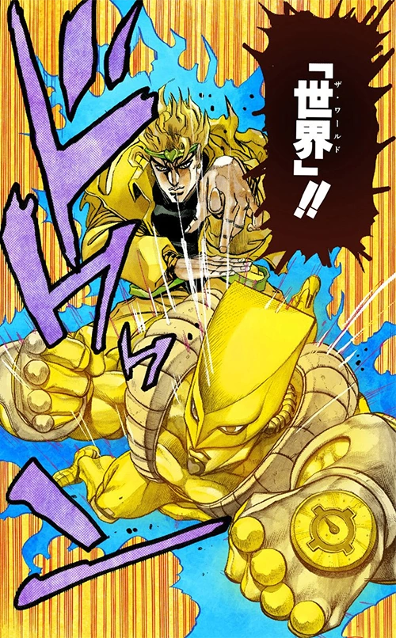         |
| :---------------------------------------------: |
| Figure 10. DIO calls out his Stand, _The World_ |

### Description

Let’s be real, who wants to play a game with only one map option? Definitely not me, and definitely not the players of JOJOLands. That’s why we’ve made sure to spice things up by allowing players to select from a variety of maps at the start of the game. Aside from the **Default Map**, it also includes:

| 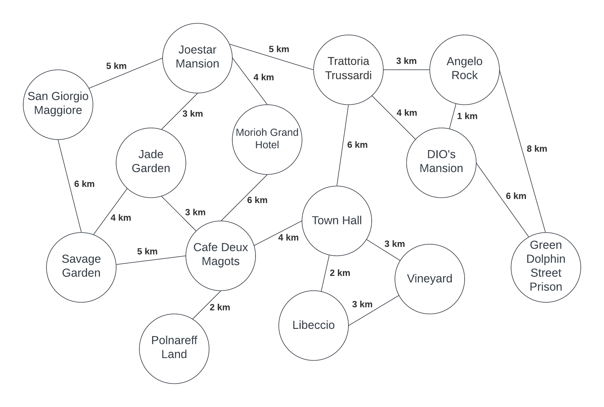 |
| :----------------------------------: |
|   Figure 11. **Parallel Map** and    |

| 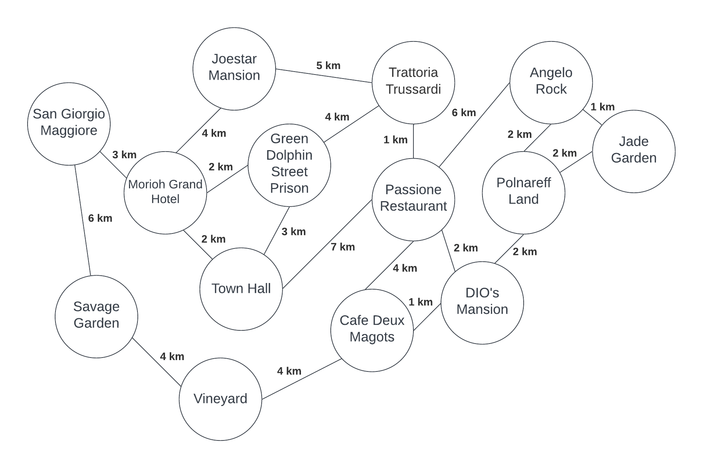 |
| :------------------------------------: |
|      Figure 12. **Alternate Map**      |

But that’s not all. To make the game even more captivating, JOJOLands has implemented the ability to save and load game states. It’s like hitting pause and picking up right where you left off! But how is this possible, you ask? Well, a clever _data structure_ is the key. With the right structure in place, loading a save file will be just like continuing to play the game from where you left off. So, buckle up and prepare for an epic adventure, because JOJOLands has got everything covered!

### Requirements

- A player can select from multiple maps available at the start of the game.
- The maps should include the **Default Map**, **Parallel Map**, and **Alternate Map**.
- A player can save the current game state.
- A player can load a game state from a save file.
- When loading a save file, the game state should be identical to the state in which it was saved.

### Sample Input/Output

#### Sample 1

```
Welcome, to the fantastical realm of JOJOLands.
[1] Start Game
[2] Load Game
[3] Exit

Select: 1
======================================================================
Select a map:
[1] Default Map
[2] Parallel Map
[3] Alternate Map

Select: 1
======================================================================
```

#### Sample 2

```
Welcome, to the fantastical realm of JOJOLands.
[1] Start Game
[2] Load Game
[3] Exit

Select: 2
Enter the path of your save file: C:\Users\JoJo\Documents\save.json
======================================================================
```

# Extra Features

## 1. Another One _Bites the Dust_

|                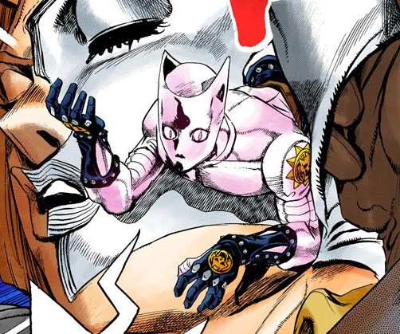                 |
| :--------------------------------------------------------------------: |
| Figure 13. _Killer Queen_’s third bomb, _Bites the Dust_, is triggered |

### Description

For Yoshikage Kira, life has become a strange and unsettling loop, with each morning feeling like a repeat of the one before. The culprit? His Stand, _Killer Queen_’s _Bites the Dust_ ability, which has the power to create a temporal loop and send time hurtling back to a previous moment. What’s even more unsettling is that Kira isn’t even aware that the time loop has occurred, with his memories limited to the locations he visited that morning. As he goes about his day, he can’t shake the feeling that something isn’t quite right and that his actions are destined to repeat themselves over and over again.

Of course, as a seasoned Stand user, Kira knows that he can’t let this continue indefinitely. He’s come to realise that if he’s been through the same consecutive locations more than once, then _Bites the Dust_ must be at work once again. It’s a strange and unsettling power, but Kira knows that he must learn to master it if he hopes to break the cycle and regain control of his quiet life.

### Requirements

- Create a new option **Another One _Bites the Dust_** in _Angelo Rock_.
- A player can enter the path of locations Yoshikage Kira remembered he went through.
- The system should display whether the _Bites the Dust_ ability has been activated.
- If so, the system should display the longest non-overlapping path of consecutive locations that are repeated at least twice in the original path, as _Bites the Dust_ was most likely to be activated when Kira passed through them.
- The path should consist of more than one location.
- If there are multiple paths with the same longest length, the system would display any of the paths.

### Sample Input/Output

#### Sample 1

```
Enter Yoshikage Kira’s path: Libeccio -> Vineyard -> Joestar Mansion
-> Vineyard -> Polnareff Land
======================================================================
Bites the Dust is not activated.
======================================================================
```

#### Sample 2

```
Enter Yoshikage Kira’s path: Jade Garden -> Town Hall -> Morioh Grand
Hotel -> Jade Garden -> Town Hall -> Jade Garden -> Town Hall -> Jade
Garden -> Town Hall -> Morioh Grand Hotel
======================================================================
Bites the Dust is most likely to be activated when Kira passed through
Jade Garden -> Town Hall -> Morioh Grand Hotel.
======================================================================
```

Although _Jade Garden_ → _Town Hall_ is repeated the most frequently in the initial path, the longest sequence of the consecutive locations is actually _Jade Garden_ → _Town Hall_ → _Morioh Grand Hotel_.

#### Sample 3

```
Enter Yoshikage Kira’s path: Savage Garden -> Angelo Rock -> Savage
Garden -> Angelo Rock -> Savage Garden
======================================================================
Bites the Dust is most likely to be activated when Kira passed through
Savage Garden -> Angelo Rock.
======================================================================
```

Since the path should not overlap with itself, _Savage Garden_ → _Angelo Rock_ → _Savage Garden_ cannot be the answer. Nevertheless, _Angelo Rock_ → _Savage Garden_ is also another possible solution.

## 2. Burning Down the House

|         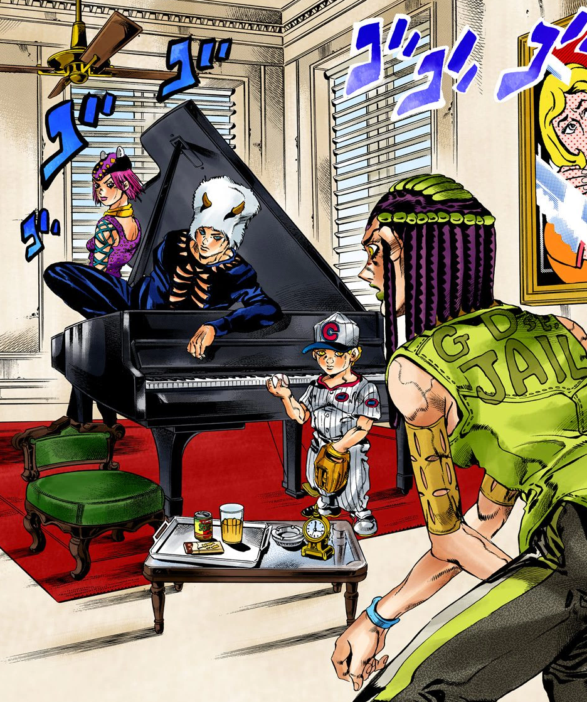          |
| :---------------------------------------------------------------------: |
| Figure 14. Ermes sees Anasui and Weather Report while in the ghost room |

### Description

Emporio Alniño’s Stand, _Burning Down the House_, is a truly fascinating power that allows him to see and interact with the ghost rooms that exist all around us. It’s no wonder that the residents of JOJOLands are eager to experience these rooms for themselves, but without Emporio’s guidance, they would be lost and unable to discover these hidden treasures.

Thankfully, Emporio is more than willing to share his knowledge and help others explore the ghost rooms to their fullest potential. With his deep understanding of the hidden workings of the world around us, he’s the perfect guide to lead visitors on a journey of discovery through the many ghost rooms that exist in JOJOLands.

Determined to share the secrets of the ghost rooms with the world, Emporio sets out to create a comprehensive guide to all of the locations that visitors can explore. Of course, with so many rooms to choose from, Emporio knows that he’ll need to keep things fresh and exciting by switching up his offerings throughout the day. But with his boundless energy and his deep passion for exploring the unknown, he’s more than up to the task.

### Requirements

- Create a new option _Burning Down the House_ in _Green Dolphin Street Prison_.
- A player can enter the location of Emporio.
- The system should display a guide that includes all the locations in JOJOLands using arrows as paths leading to Emporio’s location.
- The guide should include all locations in JOJOLands.
- All the roads composing the paths should exist on the original map.
- With the exception of Emporio’s location, every location in the guide is restricted to having only one outgoing arrow to avoid confusion.

### Sample Input/Output

```
Enter location of Emporio: Trattoria Trussardi
======================================================================
Guide:
Trattoria Trussardi <- Green Dolphin Street Prison <- Angelo Rock
  ↖ Morioh Grand Hotel <- Town Hall <- Cafe Deux Magots
  ↑                                      ↖ Polnareff Land
  ↖ San Giorgio Maggiore <- Libeccio <- DIO’s Mansion
      ↖ Jade Garden <- Joestar Mansion <- Savage Garden
                                            ↖ Vineyard
======================================================================
```

|             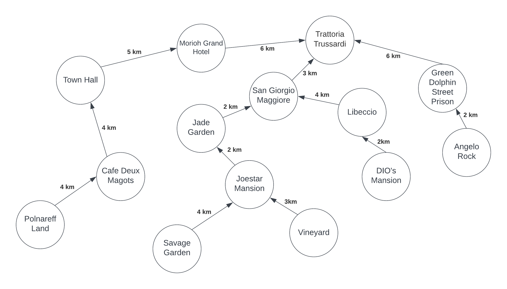              |
| :----------------------------------------------: |
| Figure 15. Graphical representation of the guide |

## 3. Chase

|                     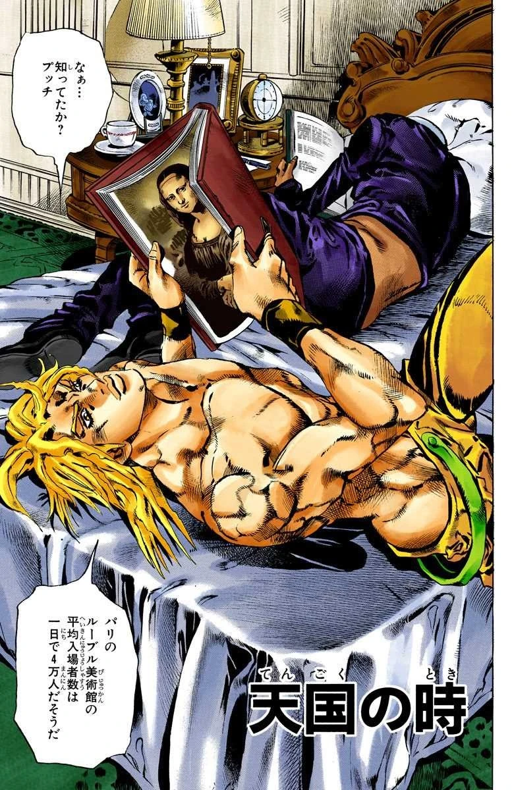                     |
| :--------------------------------------------------------------: |
| Figure 16. DIO and Pucci are lounging intimately on a shared bed |

### Description

DIO and Enrico Pucci are engaged in a thrilling game of chase, with each using their formidable Stand powers to gain an edge over the other. DIO’s Stand, _The World_, allows him to freeze time for up to nine seconds, granting him the ability to move around freely while Pucci is unable to act. However, Pucci’s Stand, _Made in Heaven_, gives him the power to accelerate time and catch up with his opponent.

The game begins with DIO and Pucci in the same location, ready to start their chase. At the start of each turn, DIO has the option to either stay put or move to an adjacent location, with the goal of putting as much distance as possible between himself and Pucci. Once DIO has moved, Pucci will then advance towards him, attempting to close the gap between them. Pucci starts out slow, only able to move 1 km in the first turn, but his Stand grants him the ability to move an additional kilometre with each subsequent turn.

The real excitement begins on the third turn, when DIO can unleash _The World_’s power to stop time and move twice in a single turn. However, this ability comes with a two-turn cooldown, which means that DIO must wait before he can use it again. As an intelligent vampire, DIO will only use this ability if it will give him an advantage in the game. If he doesn’t see a clear benefit to using it, he will hold off and save it for later turns.

The question is, can Pucci catch up to DIO’s formidable time-stopping abilities and ultimately overtake him? It’s a race against time, with both sides using every trick in their arsenal to gain the upper hand. Who will come out on top in this epic game of chase?

### Requirements

- Create a new option **Chase** in _DIO’s Mansion_.
- A player can enter the initial location where both DIO and Pucci begin in the first turn.
- The system should display the positions of DIO and Pucci after they have completed their optimal movements as specified above in each turn.
- The game terminates when Pucci reaches the same location as DIO.

### Sample Input/Output

```
Enter the initial location: Jade Garden
======================================================================
Turn 0
DIO and Pucci are at Jade Garden

Turn 1
DIO moves to Town Hall (5 km from Pucci)
Pucci moves to Jade Garden -> Town Hall (1/5) (4 km from DIO)

Turn 2
DIO moves to Morioh Grand Hotel (4 km from Pucci)
Pucci moves to Jade Garden -> Morioh Grand Hotel (1/3) (2 km from DIO)

Turn 3
DIO uses The World!
DIO moves to Trattoria Trussardi, and then Green Dolphin Street Prison
(14 km from Pucci)
Pucci moves to San Giorgio Maggiore (7 km from DIO)

Turn 4
DIO moves to Angelo Rock (9 km from Pucci)
Pucci moves to Libeccio (5 km from DIO)

Turn 5
DIO stays put (5 km from Pucci)
Pucci moves to Angelo Rock (0 km from DIO)

Pucci reaches the same location as DIO!
======================================================================
```

## 4. _Dirty Deeds Done Dirt Cheap_

|               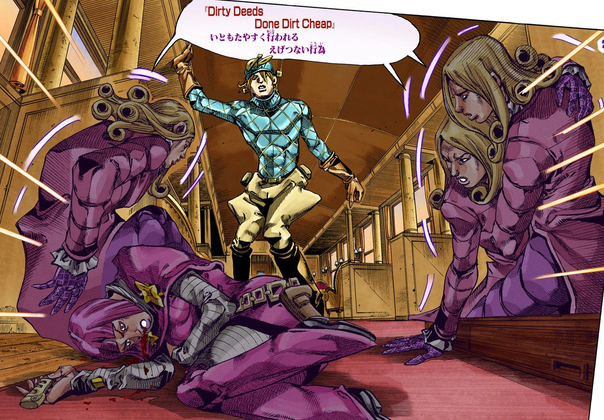                |
| :------------------------------------------------------------------------------------------: |
| Figure 17. _Dirty Deeds Done Dirt Cheap_ allows Funny Valentine to visit parallel dimensions |

### Description

Imagine being locked up in _Green Dolphin Street Prison_, surrounded by towering walls and narrow corridors. For the residents there, finding the shortest path between any two locations is not just a matter of convenience, it’s an obsession. And we’re not talking about just one measly shortcut, they want the top three shortest paths possible! But wait, there’s more. They don’t want to see the same scenery twice, so each path has to be unique and avoid visiting any location more than once. Can you imagine the challenge? But fear not, with our expert help, we can provide them with the best possible routes. Display the paths and their corresponding total distances for each journey. These prisoners are serious about their travel plans, and they won’t settle for anything less than the best!

### Requirements

- Create a new option **_Dirty Deeds Done Dirt Cheap_** in _Green Dolphin Street Prison_.
- A player can enter a source and a destination as inputs.
- The system displays the top three shortest paths with their respective total distances between the source and destination.
- If two paths have the same total distance, the one with fewer locations is given priority.
- The paths should not visit any location more than once.

### Sample Input/Output

```
Source: Town Hall
Destination: Polnareff Land
======================================================================
Top Three Shortest Paths:
1. Town Hall -> Cafe Deux Magots -> Polnareff Land (8 km)
2. Town Hall -> Jade Garden -> Cafe Deux Magots -> Polnareff Land
   (12 km)
3. Town Hall -> Cafe Deux Magots -> Savage Garden -> Polnareff Land
   (14 km)
======================================================================
```

## 5. I, Giorno Giovanna, Have a Dream

|               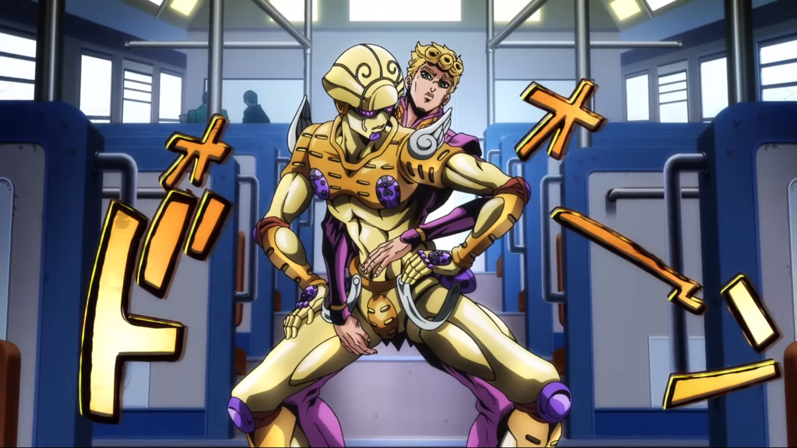               |
| :--------------------------------------------------------------------: |
| Figure 18. Giorno is striking a pose with his Stand, _Gold Experience_ |

### Description

Prepare to be dazzled by the incredible powers of “Gang-Star” Giorno Giovanna! At just 15 years old, Giorno is already a force to be reckoned with, thanks to his incredible Stand, _Gold Experience_. With the power to create lifeforms at will, Giorno has a seemingly endless army of animals at his disposal - and he’s not afraid to use them to keep JOJOLands safe and secure.

By generating an army of creatures to occupy the critical streets of JOJOLands, Giorno is able to keep a watchful eye on the most important locations in the city. But with the constant drain on his life energy that this task requires, he knows he can’t do it alone. That’s why he’s turning to you for help in identifying the most critical roads between two given locations, using the minimum total length possible.

The goal is simple - to ensure that anyone travelling between two locations in JOJOLands must pass through at least one of these critical roads. And with your help, Giorno’s army of lifeforms will be able to keep a watchful eye on these key thoroughfares, ensuring that the people of JOJOLands are safe and secure at all times.

### Requirements

- Create a new option **I, Giorno Giovanna, Have a Dream** in _Vineyard_.
- A player can enter the two locations Giorno wishes to surveil.
- The system should identify and display all critical streets between the two locations with the minimum total length.
- The system must ensure that at least one critical street is included in any path between the two specified locations.
- The system should display the total length of all critical streets.

### Sample Input/Output

```
Enter Location 1: Joestar Mansion
Enter Location 2: Trattoria Trussardi
======================================================================
Critical Streets:
1. Angelo Rock --- Green Dolphin Street Prison (2 km)
2. Green Dolphin Street Prison --- Libeccio (3 km)
3. Morioh Grand Hotel --- Trattoria Trussardi (6 km)
4. San Giorgio Maggiore --- Trattoria Trussardi (3 km)

Total Distance: 14 km
======================================================================
```

## 6. Stay the Hell Away from Me!

|                                                      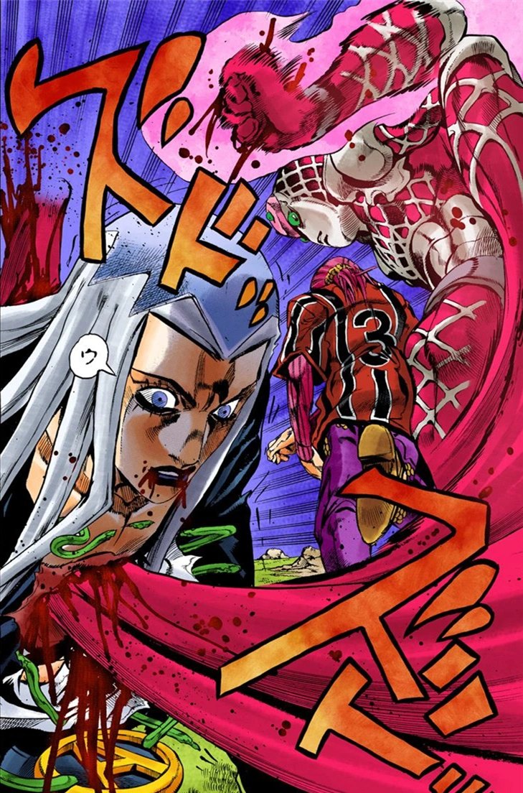                                                      |
| :---------------------------------------------------------------------------------------------------------------------------------------------: |
| Figure 19. Diavolo is deeply concerned about his privacy to the extent that he will eliminate anyone who attempts to disclose his true identity |

|                         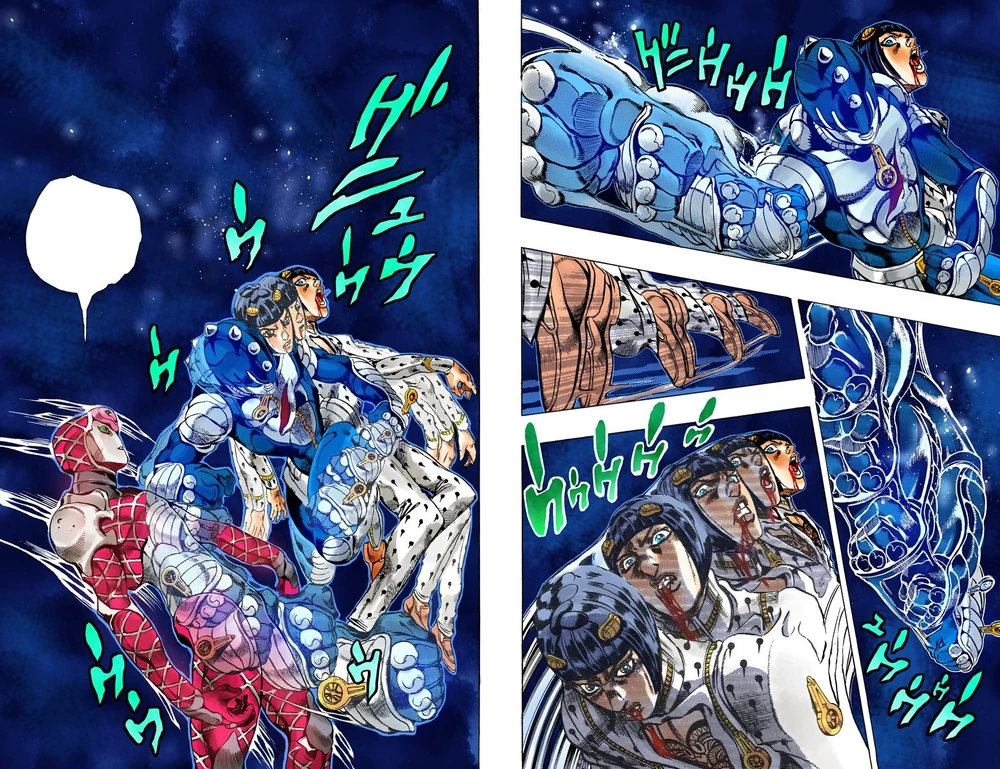                          |
| :------------------------------------------------------------------------------------: |
| Figure 20. _King Crimson_ uses time erasure to defend against _Sticky Fingers_’ attack |

### Description

Meet Diavolo, the former mafia boss, who values his privacy and likes to travel incognito. Using his Stand _King Crimson_’s power to erase a ten-second time frame, he can wipe out any memory of his presence during that period. However, this ability can be quite draining for him, and he needs to conserve it while travelling the shortest distance between his destinations. Being an extreme introvert, Diavolo avoids any attention and has already identified the locations where people might spot him, thanks to his _Epitaph_’s ability to see into the future. Can you help Diavolo come up with a plan to minimise the use of his time-erasing power while ensuring he can travel freely without anyone noticing him?

### Requirements

- Create a new option **Stay the Hell Away from Me!** in _San Giorgio Maggiore_.
- A player can enter the starting and ending points for Diavolo’s great journey, along with the locations where people might notice him as predicted using _Epitaph_.
- Each time Diavolo passes through one of the identified locations, he has to use _King Crimson_’s ability to erase the time frame.
- The system should display the optimal path with the least number of times Diavolo has to activate his Stand’s ability and total distance.
- The system should only display the path with the shortest distance if there are multiple paths with the same number of activation.

### Sample Input/Output

```
Source: Town Hall
Destination: Joestar Mansion
Identified Locations: Jade Garden, San Giorgio Maggiore, Vineyard
======================================================================
Optimal Path:
Town Hall -> Cafe Deux Magots -> Savage Garden -> Joestar Mansion
(12 km)
======================================================================
```

This is the shortest possible path without Diavolo activating the ability of _King Crimson_.

## 7. The Golden Spirit

|                                    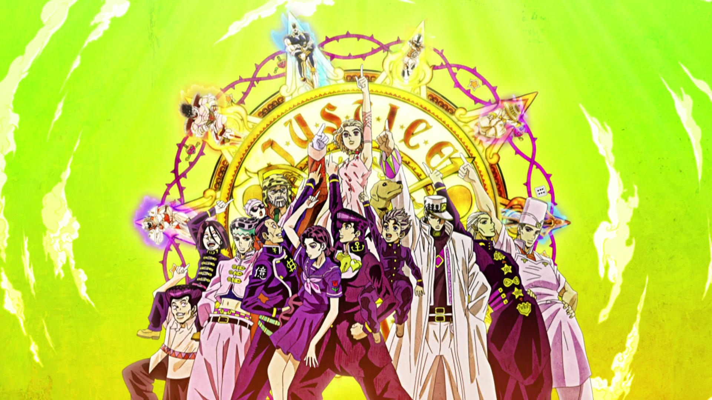                                     |
| :-----------------------------------------------------------------------------------------------------------: |
| Figure 21. Standing in front of the Justice clock, the protectors of Morioh point upwards towards the heavens |

### Description

The Joestar family tree is a remarkable legacy of courage and power passed down through generations. However, the Joestars are always on the lookout for ways to further strengthen their bond as a family. Recently, they became interested in uncovering their common ancestors. While they have a family tree, the Joestars need an algorithm to identify all the lowest common ancestors of any two family members. The lowest common ancestor of any two Joestars is the one who holds the lowest position in the family tree and has both Joestars as their descendants. It’s important to note that individuals are **not** considered descendants of themselves. With this algorithm, the Joestars can deepen their connection and further cement their family legacy.

### Requirements

- Create a new option **The Golden Spirit** in _Joestar Mansion_.
- A player can enter the names of any two Joestars to search for their lowest common ancestors.
- The system should display all lowest common ancestors of the two Joestars entered.
- Note that there might be more than one lowest common ancestor.

### Sample Input/Output

#### Sample 1

```
Enter the name of first Joestar: Josuke Higashikata
Enter the name of second Joestar: Giorno Giovanna
======================================================================
Lowest Common Ancestor of Josuke Higashikata and Giorno Giovanna:
Jonathan Joestar
======================================================================
```

#### Sample 2

```
Enter the name of first Joestar: Jotaro Kujo
Enter the name of second Joestar: Jolyne Cujoh
======================================================================
Lowest Common Ancestors of Jotaro Kujo and Jolyne Cujoh:
Holy Kujo and Sadao Kujo
======================================================================
```

## 8. Thus Spoke Rohan Kishibe

| 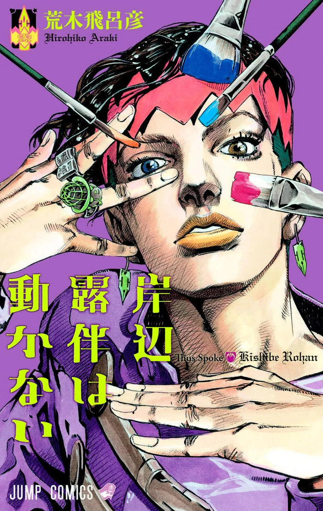 |
| :---------------------------------------------------------: |
|     Figure 22. Thus Spoke Rohan Kishibe Volume 1 Cover      |

### Description

Acclaimed manga artist Rohan Kishibe seeks to draw inspiration from various locations throughout JOJOLands using his Stand _Heaven’s Door_. With the destinations already in mind, the only remaining hurdle is identifying the optimal route from his residence to these locales. In a peculiar turn of events, Rohan envisions you as a book and imbues you with the imperative to develop an algorithm for finding the shortest path between his home and the designated sites. This command is so potent that you must adhere to it without exception, regardless of any physical or mental obstacles.

### Requirements

- Create a new option **Thus Spoke Rohan Kishibe** in _Morioh Grand Hotel_.
- A player can enter the locations that Rohan would like to visit.
- The system should display the shortest path, which starts from Rohan’s home (_Morioh Grand Hotel_) and includes all the locations specified, with the total distance.
- The sequence in which Rohan visits the locations doesn’t matter.
- Rohan doesn’t mind passing through other places or visiting a location more than once.

### Sample Input/Output

```
Enter the locations: Jade Garden, Libeccio, Vineyard
======================================================================
Shortest Path:
Morioh Grand Hotel -> Jade Garden -> Joestar Mansion -> Vineyard ->
DIO’s Mansion -> Libeccio (13 km)
======================================================================
```

## 9. Vento Aureo

|                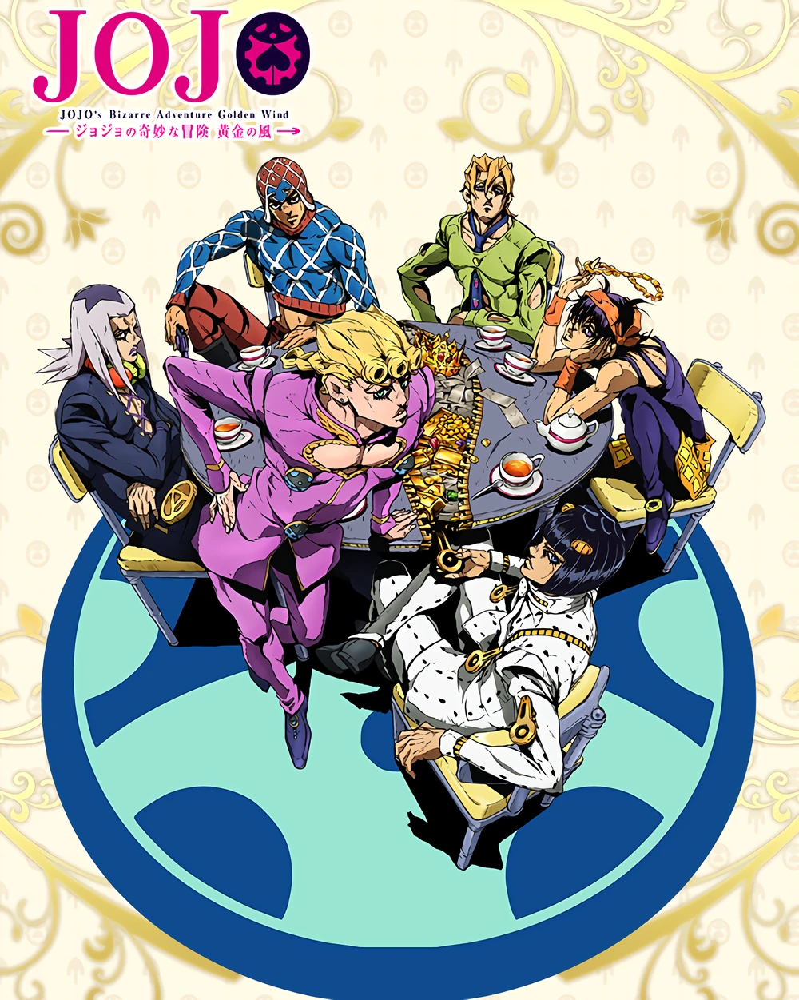                 |
| :------------------------------------------------------------------------: |
| Figure 23. Team Bucciarati in JoJo’s Bizarre Adventure Part 5: Golden Wind |

### Description

Team Bucciarati is exploring ways to enhance their management of territories in JOJOLands, and they believe that dividing the region into smaller districts may help achieve that goal. To assist with their endeavour, they have enlisted your expertise in creating a flexible system that allows them to experiment with different combinations of locations to form individual districts. With this system, they hope to optimise their collection of protection money and streamline their operations in JOJOLands.

### Requirements

- Create a new option **_Vento Aureo_** in _Vineyard_.
- A player can enter two locations to be combined into one district at each round.
- Both locations must be connected via a road in JOJOLands to be considered valid.
- The system should display all districts formed and the locations that have not yet been categorised, along with the number of locations in each group.
- The order of the districts and locations can be arbitrary.
- A player can exit the _Vento Aureo_ at any time.
- The system should terminate the _Vento Aureo_ automatically when all locations have been integrated into a single district.

### Sample Input/Output

In this sample, we only include 7 locations for brevity: _Cafe Deux Magots_, _Jade Garden_, _Joestar Mansion_, _Morioh Grand Hotel_, _Polnareff Land_, _Savage Garden_, and _Town Hall_.

```
Combine: Cafe Deux Magots & Town Hall
======================================================================
District 1: { Cafe Deux Magots, Town Hall } (2 locations)
Uncategorised: { Jade Garden, Joestar Mansion, Morioh Grand Hotel,
                 Polnareff Land, Savage Garden } (5 locations)
======================================================================
Combine: Polnareff Land & Savage Garden
======================================================================
District 1: { Cafe Deux Magots, Town Hall } (2 locations)
District 2: { Polnareff Land, Savage Garden } (2 locations)
Uncategorised: { Jade Garden, Joestar Mansion, Morioh Grand Hotel }
               (3 locations)
======================================================================
Combine: Jade Garden & Joestar Mansion
======================================================================
District 1: { Cafe Deux Magots, Town Hall } (2 locations)
District 2: { Polnareff Land, Savage Garden } (2 locations)
District 3: { Jade Garden, Joestar Mansion } (2 locations)
Uncategorised: { Morioh Grand Hotel } (1 location)
======================================================================
Combine: Jade Garden & Savage Garden
======================================================================
Jade Garden and Savage Garden are not connected by a road!
======================================================================
Combine: Jade Garden & Town Hall
======================================================================
District 1: { Cafe Deux Magots, Jade Garden, Joestar Mansion,
              Town Hall } (4 locations)
District 2: { Polnareff Land, Savage Garden } (2 locations)
Uncategorised: { Morioh Grand Hotel } (1 location)
======================================================================
Combine: Exit
======================================================================
```

## 10. Wheel of Fortune

|           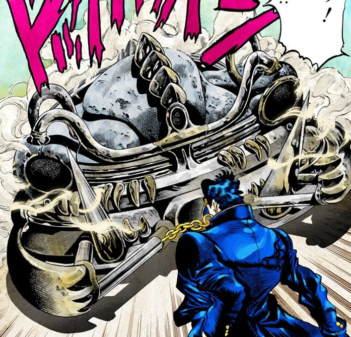           |
| :--------------------------------------------------------------: |
| Figure 24. Before Jotaro stands the monstrous _Wheel of Fortune_ |

### Description

As the mayor of JOJOLands, you’re always thinking about how to improve the lives of your citizens. You know that transportation is a critical part of any city’s infrastructure, and you’ve decided that it’s time to introduce bus and rail services. But you don’t want to just throw together some routes and hope for the best – you want to design the most efficient paths possible.

For the bus transport, you want to make sure that **every street** in JOJOLands is covered, starting from a specific location. It doesn’t matter if the bus passes through the same location or street more than once – as long as it hits every spot, you’ll be satisfied. And for the rail transport, you want to make sure that **each location** is visited once before the train returns to its starting point.

### Requirements

- Create a new option **Morioh Bus** in _Town Hall_.
- In Morioh Bus,
  - A player can enter the starting location of the bus transport.
  - The system should display the shortest possible route that covers every street in JOJOLands with its total distance.
  - The bus transport can pass through the same location or street more than once.
  - It is not necessary for the bus transport to return to its initial position.
- Create a new option **Express Train** in _Town Hall_.
- In Express Train,
  - A player can enter the starting location of the rail transport.
  - The system should display the shortest possible path that visits every location in JOJOLands only once before returning to the starting point with its total distance.
  - If such a path is impossible, the system should display a message indicating so.

### Sample Input/Output

#### Sample 1

```
Enter the starting location: Town Hall
======================================================================
Shortest Morioh Bus Route:
Town Hall
-> Cafe Deux Magots (4 km)
-> Polnareff Land (4 km)
-> Savage Garden (6 km)
-> Cafe Deux Magots (4 km)
-> Jade Garden (3 km)
-> Joestar Mansion (2 km)
-> Savage Garden (4 km)
-> Vineyard (8 km)
-> Joestar Mansion (3 km)
-> Libeccio (6 km)
-> Vineyard (6 km)
-> DIO’s Mansion (3 km)
-> Libeccio (2 km)
-> San Giorgio Maggiore (4 km)
-> Jade Garden (2 km)
-> Morioh Grand Hotel (3 km)
-> Trattoria Trussardi (6 km)
-> Green Dolphin Street Prison (6 km)
-> Libeccio (3 km)
-> DIO’s Mansion (2 km)
-> Angelo Rock (3 km)
-> Green Dolphin Street Prison (2 km)
-> Trattoria Trussardi (6 km)
-> San Giorgio Maggiore (3 km)
-> Jade Garden (2 km)
-> Town Hall (5 km)
-> Morioh Grand Hotel (5 km)

Total Distance: 107 km
======================================================================
```

#### Sample 2

```
Enter the starting location: Town Hall
======================================================================
Shortest Express Train Route:
Town Hall
-> Morioh Grand Hotel (5 km)
-> Jade Garden (3 km)
-> San Giorgio Maggiore (2 km)
-> Trattoria Trussardi (3 km)
-> Green Dolphin Street Prison (6 km)
-> Angelo Rock (2 km)
-> DIO’s Mansion (3 km)
-> Libeccio (2 km)
-> Vineyard (6 km)
-> Joestar Mansion (3 km)
-> Savage Garden (4 km)
-> Polnareff Land (6 km)
-> Cafe Deux Magots (4 km)
-> Town Hall (4 km)

Total Distance: 53 km
======================================================================
```

#### Sample 3

```
Enter the starting location: Town Hall
======================================================================
Shortest Express Train Route:
Town Hall
-> Cafe Deux Magots (4 km)
-> Polnareff Land (4 km)
-> Savage Garden (6 km)
-> Joestar Mansion (4 km)
-> Vineyard (3 km)
-> DIO’s Mansion (3 km)
-> Angelo Rock (3 km)
-> Green Dolphin Street Prison (2 km)
-> Libeccio (3 km)
-> San Giorgio Maggiore (4 km)
-> Trattoria Trussardi (3 km)
-> Morioh Grand Hotel (6 km)
-> Jade Garden (3 km)
-> Town Hall (5 km)

Total Distance: 53 km
======================================================================
```

This is an alternative solution that produces the same minimum total distance.

## 11. Always Think Out of the Box Like We Do

The sky’s the limit! The assignment is your canvas to showcase your skills and creativity, so let your imagination run wild and create something truly extraordinary! But don’t forget to make it worth those extra marks!

# Tips or Recommendations

## From Wei Hong

|                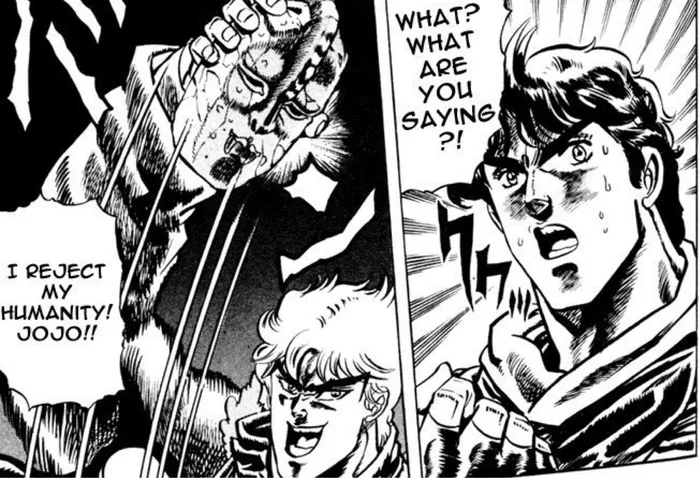                |
| :----------------------------------------------------------------------: |
| Figure 25. Dio Brando rejects his humanity and transforms into a vampire |

- I crafted this assignment after rejecting my humanity; perhaps you could give it a try as well.
- I have invested endless hours into this assignment, and I hope you’ll have the opportunity to do the same.
- I intentionally designed this assignment to be challenging for individual and independent completion. So, team leaders, please ensure you closely collaborate with your team members, utilising a version control system to maintain your well-being.

## From Wei Han

- All of the questions, especially extra features, involve data structures. Try to identify which one to use and come up with a solution from it.
- All of the extra features require certain algorithms for the data structures, you can identify and search for the algorithm to understand the concepts and implementations of it online.
- Try to have a proper GitHub collaboration flow and make sure everyone knows how to collaborate properly.

# References

## GitHub Repository

To stay informed about any potential changes or updates to this assignment, you may visit our [GitHub repository](https://github.com/samweihong/JOJOLands).

## Data Files

The necessary data files for this assignment can be obtained from the following links:

- [**residents.csv**](https://github.com/samweihong/JOJOLands/blob/main/data/residents.csv)
- [**stands.csv**](https://github.com/samweihong/JOJOLands/blob/main/data/stands.csv)

## Helpful Videos

To gain further knowledge about JoJo’s Bizarre Adventure, you may refer to these legal YouTube videos:

- [Part 1 **Phantom Blood** and Part 2 **Battle Tendency**](https://www.youtube.com/playlist?list=PLwLSw1_eDZl0CVpnjetepbYfC4ZuePqo6)
- [Part 3 **Stardust Crusaders**](https://www.youtube.com/playlist?list=PLwLSw1_eDZl0czPmhfn0WI_a-aSqFEqTf)
- [Part 4 **Diamond is Unbreakable**](https://www.youtube.com/playlist?list=PLwLSw1_eDZl0jARZZpGq5kcYDDQXZ0wZb)
- [Part 5 **Golden Wind**](https://www.youtube.com/playlist?list=PLwLSw1_eDZl0Hlilj-CAwmciWsIVvFJ0L)
- [Part 6 **Stone Ocean**](https://www.youtube.com/watch?v=EeCX8Y0a278)
- [Stress Relief](https://www.youtube.com/watch?v=Jzz53fC-9Kw)

# Contact Information

Whether you’re looking to confront the mastermind behind this crazy JOJOLands assignment, or just looking for someone to chat with about all things JoJo, we’ve got you covered.

For those seeking confrontation, look no further than **Sam Wei Hong** (<u2102776@siswa.um.edu.my>). While we don’t recommend physical confrontation, Wei Hong is the person to contact if you have any strong opinions or concerns about the assignment.

On the other hand, if you’re looking for a friendly and knowledgeable JoJo fan to chat with, **Yau Wei Han** (<u2102749@siswa.um.edu.my>) is your go-to person. Whether you prefer online or in-person conversations, Wei Han is always happy to talk about all aspects of the JoJo universe.

And of course, if you have any questions and feedback about the assignment itself, feel free to reach out to either of us. We’re always happy to help and ensure you have all the information you need to succeed in your JoJo adventure!

|           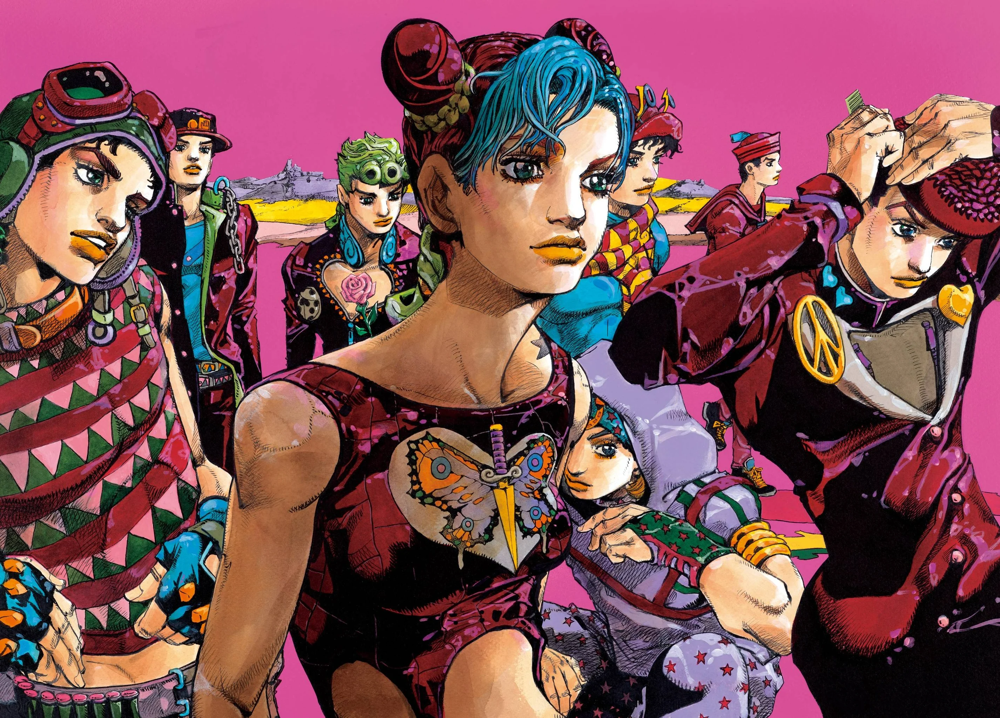           |
| :------------------------------------------: |
| Figure 26. Have a blast exploring JOJOLands! |
